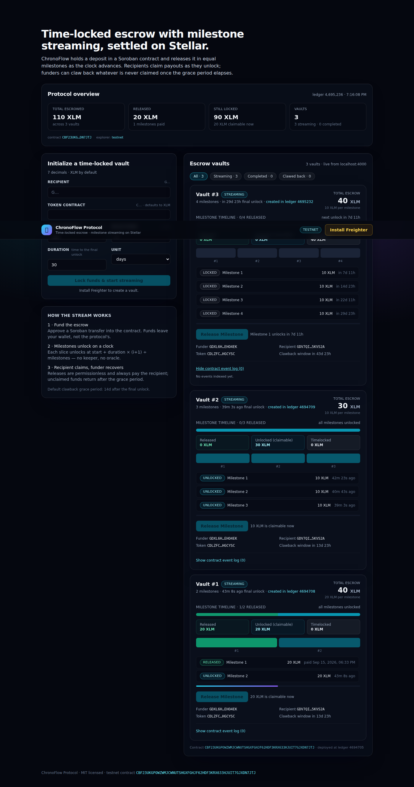
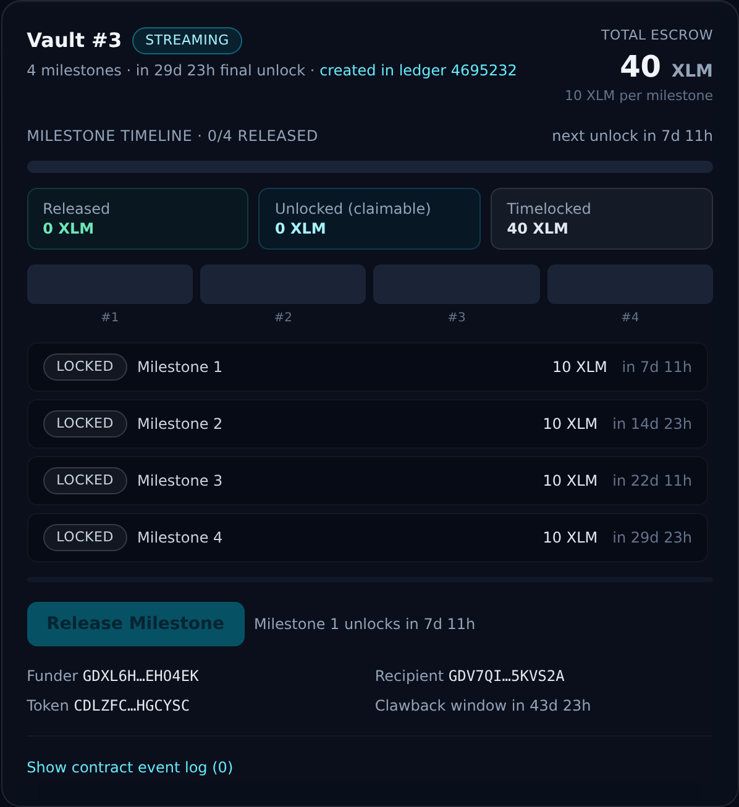
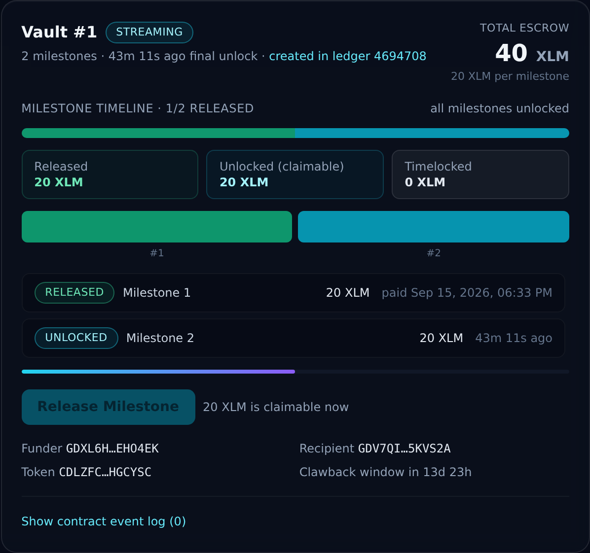
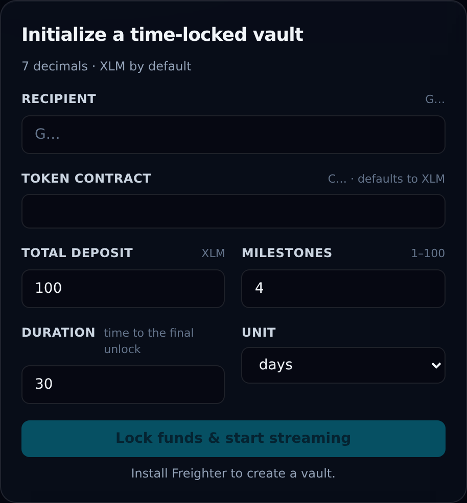
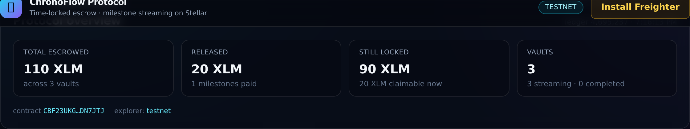
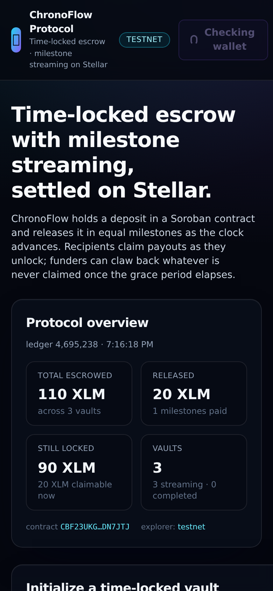

# ChronoFlow Protocol

**On-chain time-locked escrow and milestone-based payment streaming, built on Stellar with Soroban.**

ChronoFlow lets a funder lock a token deposit in a Soroban contract and stream it to a recipient
in equal milestones as time passes. Nothing is trusted to a keeper: the schedule is derived from
the ledger clock, releases are permissionless, and whatever the recipient never claims returns to
the funder after a grace period.

```
funder ──deposit──▶ ┌──────────────────────┐
                    │  chronoflow_escrow   │  unlocks at start + duration × (i+1) ÷ milestones
recipient ◀─payout──┤   (Soroban contract) │  permissionless release, ordered milestones
funder  ◀─clawback──└──────────────────────┘  unclaimed funds after the grace period
```

|                        |                                                                                                                                                                         |
| ---------------------- | ----------------------------------------------------------------------------------------------------------------------------------------------------------------------- |
| **Contract (testnet)** | [`CBF23UKGPOWZWMJCWNUTSHGXFGHJF62HDF3KRX633HJUIT7GJXDN7JTJ`](https://stellar.expert/explorer/testnet/contract/CBF23UKGPOWZWMJCWNUTSHGXFGHJF62HDF3KRX633HJUIT7GJXDN7JTJ) |
| **Deployed in ledger** | `4694705` (wasm hash `095f5fc3…`)                                                                                                                                       |
| **Contract tests**     | 36 Rust unit tests · 98.1% line coverage                                                                                                                                |
| **App tests**          | 34 backend (Vitest) · 38 frontend (Vitest)                                                                                                                              |
| **Toolchain**          | Rust + `soroban-sdk` 27 · Stellar CLI 28 · Node ≥ 22.13 · pnpm 11                                                                                                       |

---

## Screenshots

Real captures of the dApp against the live testnet deployment, showing three vaults mid-flight: one
fully timelocked, one fully unlocked and one part-way through (with a released milestone in its
indexed event log). No mocks — the data comes from the indexer API and the contract itself.



| Timeline: funds still timelocked                                              | Timeline: a released milestone + claimable payout                                               |
| ----------------------------------------------------------------------------- | ----------------------------------------------------------------------------------------------- |
|  |  |
| **Initialize a vault**                                                        | **Protocol overview**                                                                           |
|   |                                          |

<p align="center">
  
  <br>
  <em>Responsive layout, same data</em>
</p>

Regenerate them with a local stack running:

```bash
pnpm --filter @chronoflow/backend run db:push
cd packages/backend && DATABASE_URL="file:./dev.db" INDEXER_ENABLED=true node dist/index.js &   # API on :4000
pnpm --filter @chronoflow/frontend run build && pnpm --filter @chronoflow/frontend run start -- -p 3100
pnpm --filter @chronoflow/frontend exec playwright install chromium   # once
pnpm --filter @chronoflow/frontend run screenshots                    # writes docs/images/
```

---

## Repository layout

```
chronoflow-protocol/
├── packages/
│   ├── contracts/            Rust + Soroban
│   │   ├── contracts/chronoflow-escrow/   the escrow contract (lib.rs, test.rs)
│   │   ├── scripts/                       build / test / lint / coverage / deploy / export
│   │   └── deployments/                   registry of every deployment (contract id + ledger)
│   ├── backend/              Node + TypeScript indexer & REST API
│   │   ├── src/indexer/                   Soroban RPC event poller → Prisma projections
│   │   ├── src/routes/                    /api/vaults, /api/vaults/:id, /api/stats, /health
│   │   └── prisma/                        SQLite (default) or PostgreSQL schema
│   └── frontend/             Next.js 14 App Router dApp
│       ├── src/lib/                       Soroban client, Freighter wallet, API client, maths
│       └── src/components/                wallet, vault form, timeline, actions
├── docs/                     architecture + deployment guides
└── .github/workflows/        CI (Rust/TS tests, wasm build, coverage) + manual deploy
```

Both app packages import `src/generated/chronoflow.ts` — a module the deploy script generates from
the compiled contract spec, carrying the contract id, RPC url, network passphrase, method/event
spec, error codes and data keys. Switching deployments never means editing app code.

---

## Quickstart

```bash
# 0. prerequisites: Node ≥ 22.13, pnpm 11, Rust + wasm32v1-none target, Stellar CLI
corepack enable
rustup target add wasm32v1-none

# 1. install everything
pnpm install

# 2. build the contract and run its tests
pnpm --filter @chronoflow/contracts run build
pnpm --filter @chronoflow/contracts run test

# 3. point the apps at a deployment (writes generated config + bindings)
pnpm run deploy:testnet          # or: pnpm run export  (re-export an existing deployment)

# 4. run the indexer API + dApp
pnpm --filter @chronoflow/backend run db:push
pnpm run dev                     # backend on :4000, dApp on :3000
```

Then open <http://localhost:3000>, install [Freighter](https://www.freighter.app/), switch it to
**Testnet**, and create a vault. Need testnet XLM? <https://friendbot.stellar.org>.

### Common commands

| Command                   | What it does                                          |
| ------------------------- | ----------------------------------------------------- |
| `pnpm run dev`            | backend (`tsx watch`) + dApp (`next dev`) in parallel |
| `pnpm run test`           | Rust contract tests + backend + frontend suites       |
| `pnpm run test:coverage`  | contract coverage report (`cargo llvm-cov`)           |
| `pnpm run lint`           | `cargo fmt`/`clippy -D warnings`, ESLint, `next lint` |
| `pnpm run typecheck`      | `cargo check`, `tsc --noEmit` for both app packages   |
| `pnpm run build`          | wasm + backend `dist` + Next production build         |
| `pnpm run deploy:testnet` | build, deploy, export artifacts, generate bindings    |
| `pnpm run format`         | Prettier over TS/JSON/MD/YAML                         |

---

## How the protocol works

**Vault lifecycle.** A vault is created with `create_vault(funder, recipient, token, amount,
duration, milestones)`. The deposit is split into `milestones` equal slices, and slice `i` unlocks at

```
unlock(i) = start_time + duration × (i + 1) ÷ milestones     // integer division, ledger clock
```

so the whole stream spans exactly `duration` seconds, ending in the final slice. Milestones unlock
**strictly in order**.

- `release_milestone(vault_id)` — permissionless. Pays the _next_ unlocked slice to the vault's
  stored recipient and emits `MilestoneReleased`. When the last slice lands the vault becomes
  `Completed` and emits `VaultCompleted`.
- `clawback(vault_id)` — funder-only, and only once
  `clawback_time = start_time + duration + clawback_delay` has passed. Returns every unclaimed
  slice to the funder and emits `VaultClawedBack`. Released funds are never touched, and clawback
  stays available while the protocol is paused so capital can always be recovered.
- Admin entry points (`set_paused`, `set_clawback_delay`) emit `ContractPauseToggled` and
  `ClawbackDelayUpdated`.

Vaults live in persistent storage (`Vault` key), configuration in instance storage
(`Admin`, `ClawbackDelay`, `Paused`, `NextVaultId`). Errors are typed (`VaultNotFound`,
`MilestoneLocked`, `NoMilestonesRemaining`, `ClawbackTooEarly`, …) and the frontend maps each code
back to plain-language guidance.

### Ecosystem integrations

- **Indexer (`packages/backend`)** — a Viem-style poller built on `@stellar/stellar-sdk`'s RPC
  client. It scans forward from the deployment ledger, decodes each event against the generated
  contract spec, folds it into Prisma within a transaction keyed by the RPC event id (so replays and
  restarts are idempotent), and serves the projections as REST + aggregates.
- **dApp (`packages/frontend`)** — Freighter wallet connect, a vault creation form with full
  client-side validation, a live milestone timeline (locked / unlocked / released funds), and direct
  contract buttons for **Release Milestone / Claim Payout** and **Clawback Escrow**. Reads come from
  the indexer API and writes go straight to Soroban via `prepareTransaction` → wallet signature →
  `sendTransaction`.

---

## Documentation

- [`docs/architecture.md`](docs/architecture.md) — contract state machine, storage layout, event
  schema, indexer flow and API reference.
- [`docs/deployment.md`](docs/deployment.md) — deploy the contract to Stellar testnet, the API to
  Render or Fly.io, and the dApp to Vercel, with the full env-var reference.
- [`packages/contracts/README.md`](packages/contracts/README.md) — the contract, its invariants and
  the script suite.
- [`packages/backend/README.md`](packages/backend/README.md) — indexer internals, endpoints, schema.
- [`packages/frontend/README.md`](packages/frontend/README.md) — dApp structure, wallet flow, theming.

---

## Security notes

This is unaudited reference code. Before mainnet use: have the contract audited, run a dedicated
admin multisig, keep the deployer key in a hardware wallet or secret manager, and review the
clawback delay for your recipients' expectations. The escrow never custodies funds beyond the
contract's own balance, and only ever pays the addresses stored at vault creation.

## License

[MIT](LICENSE) — see [CONTRIBUTING.md](CONTRIBUTING.md) for the development workflow.
